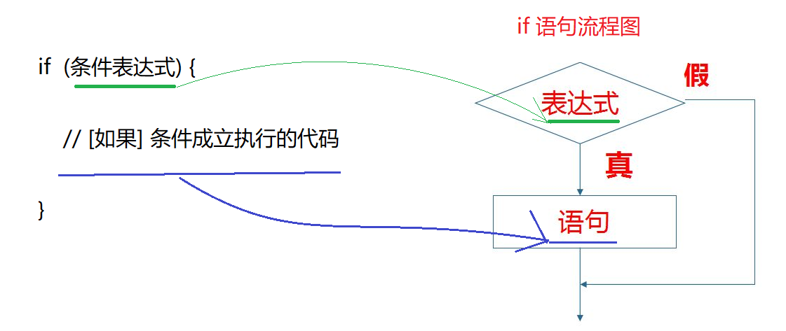
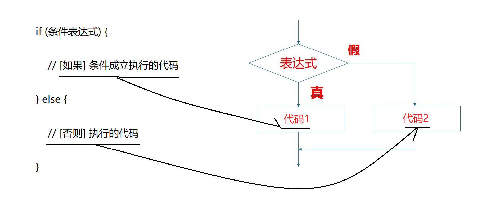
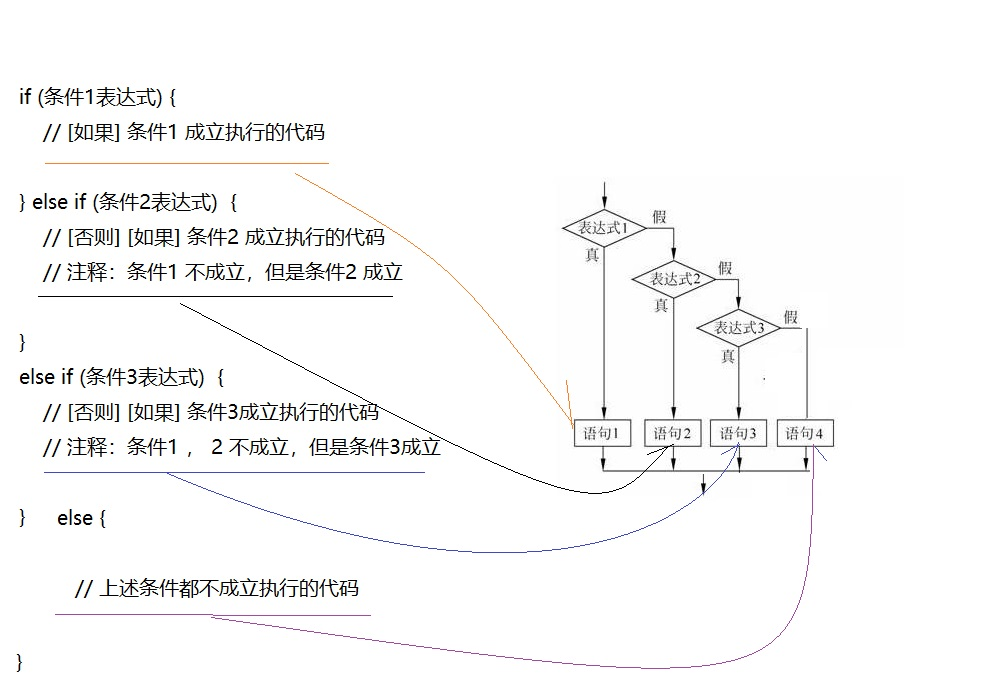
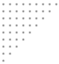
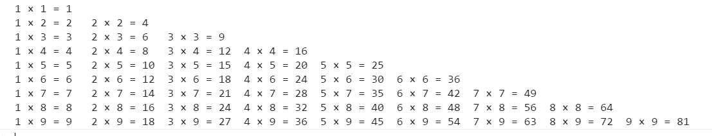
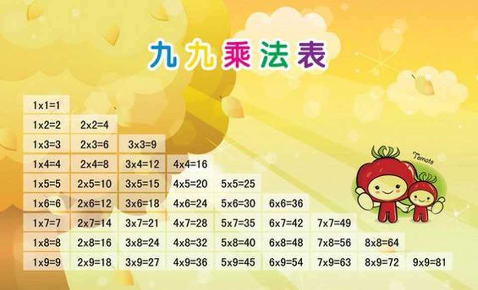
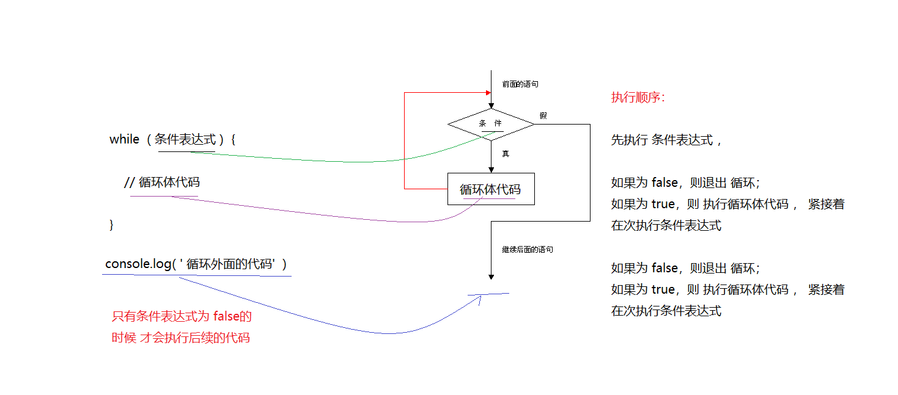
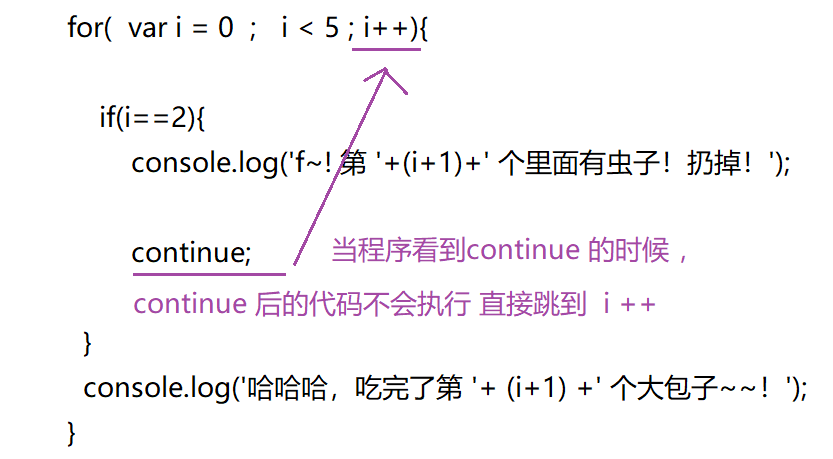
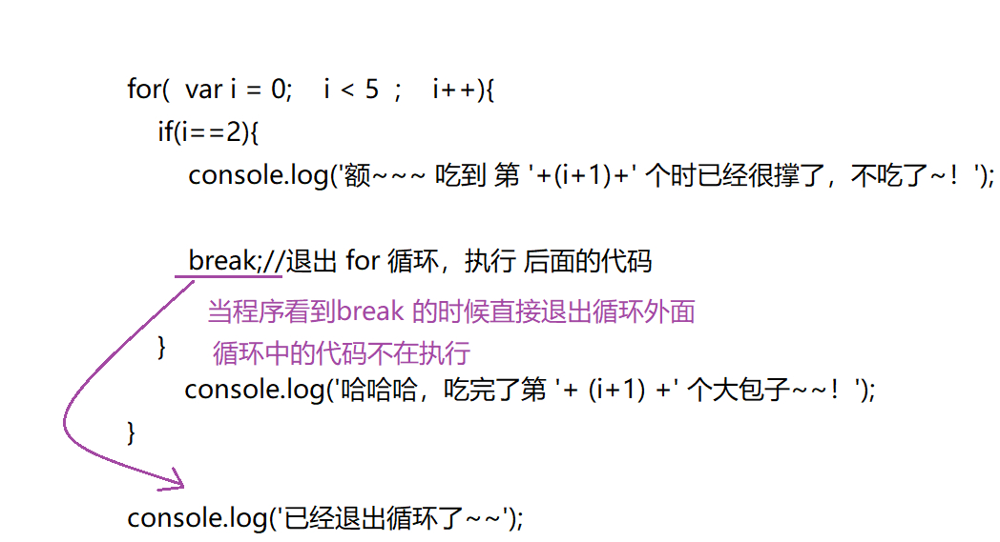

---

typora-copy-images-to: media
---

> 第02阶段.前端基本功.前端基础.入门语法

## 学习目标
* 理解
  * 掌握 算术运算符、关系运算符 、逻辑运算符、赋值运算符 以及 运算符 优先级
  * js流程控制的三种结构
  * if 条件分支结构
  * switch分支结构
  * 三元表达式
  * for 循环
* 应用
  * 能使用条件分支语句完成 判断闰年 计算成绩案例
  * 能使用for循环完成  累加求和 等案例
* 推荐前端行业APP
  * 开发者头条、掘金

# 一.核心内容

## 1. 运算符

有时候也成为操作符  operate  

### 1.1 算数运算符

是完成基本算数运算使用的符号，用来处理四则运算

| 运算符 | 描述         | 实例                     |
| ------ | ------------ | ------------------------ |
| +      | 加           | 10 + 20 = 30             |
| -      | 减           | 10 - 20 = -10            |
| *      | 乘           | 10 * 20 = 200            |
| /      | 除           | 10 / 20 = 0.5            |
| %      | 取余数(取模) | 返回除法的余数 9 % 2 = 1 |

**例子：**

```js
var res = 15 + 6;
res = 21 - 15;
res = 3 * 5;
res = 10 / 20;
res = 9 % 2;  
```

> 课堂提问？ 

我们怎么判断 一个数能够被整除呢？     它的余数是  0 

注意这些算术运算符也有先后顺序， 先乘除取余   后 加减。

### 1.2 一元运算符

一些只需要一个操作数的运算符称为一元运算符。  比如 +15    -15  正负    ! 取反  还有  ++  和   --  

####  1) 前置运算(理解)

在 JavaScript 中，`++` 和 `--` 既可以放在**变量**前面，也可以放在变量后面。以自增举例：

- `++num` **前置自增** ：先自加   后返回值 

```javascript
var num = 7;
alert(++num); // 8
alert(num);   // 8

```

```javascript
var  num = 10;
alert(++num + 10);
```


#### 2) 后置运算(重点)

- num++` **后置自增**：先 返回原值     后 自加 

```javascript
var num = 7;
alert(num++); // 7
alert(num);   // 8
```


```javascript
var  num = 10;
alert(10 + num++);
```

**课堂练习：**

```javascript
var a = 10;
++a;
var b = ++a + 2;
console.log(b);

var c = 10;
c++;
var d = c++ + 2;
console.log(d);
```


####  3)  自增自减运算符 小结

- `++` 和 `--` 运算符目的可以简化代码的编写，让变量的值 `+ 1` 或者 `- 1`；


- 单独使用时，运行结果相同；
- 与其他代码联用时，执行结果会不同 
- **后置**：先  原值运算    后 自加     ---先人后己 
- **前置**：先自加  后运算  
- **开发时**，**大多使用后置自增/减，并且代码独占一行**，例如：`num++;` 或者 `num--;`。
- 开发时，和其他代码联用 —— 会降低代码的**可读性**
- 开发的时候，我们更喜欢用 num++

**不易读的代码示例**：

```js
var a = 1;
var b = ++a + ++a; // 此处 和 +号 同时使用，会影响 到 后面 ++a 的执行过程
alert(b); // 5
```

### 1.3 关系运算符（比较运算符）

**概念：** 关系运算符， 两个数据 进行比较的运算符，会 返回 一个 布尔值（`true / false`），作为比较运算的结果。如：

````js
var res = 1 > 2;
console.log(res); // false
````

| 运算符名称    | 说明                          | 案例        | 结果  |
| ------------- | ----------------------------- | ----------- | ----- |
| <             | 小于号                        | 1 < 2       | true  |
| >             | 大于号                        | 1 > 2       | false |
| >=            | 大于等于号 (大于或者等于)     | 2 >= 2      | true  |
| <=            | 小于等于号 (小于或者等于)     | 3 <= 2      | false |
| ==            | 判等号（会转型）              | 37 == 37    | true  |
| !=            | 不等号                        | 37 != 37    | false |
| ===       !== | 全等  要求值和 数据类型都一致 | 37 === '37' | false |

> **课堂提问：**下面代码中 三个 res 结果为？

```` js
var num1 = 10;
var num2 = 100;
var res1 = num1 > num2;   
var res2 = num1 == 11;   
var res3 = num1 != num2; 
````

**=总结**

| 符号 | 作用 | 用法                                     |
| ---- | ---- | ---------------------------------------- |
| =    | 赋值 | 把右边给左边                             |
| ==   | 判断 | 判断两边值是否相等（注意此时有隐式转换） |
| ===  | 全等 | 判断两边的值和数据类型是否完全相同       |

~~~js
console.log(18 == '18');
console.log(18 === '18');
~~~


### 1.4 逻辑运算符 

**概念：** 逻辑运算符，用来进行若干个布尔值 运算的 运算符，返回值也是布尔值。

| 逻辑运算符 | 说明                      | 案例           |
| ---------- | ------------------------- | -------------- |
| &&         | "逻辑与"，简称 "与"   and | exp1 && exp2   |
| \|\|       | "逻辑或"，简称 "或"   or  | exp1 \|\| exp2 |
| ！         | "逻辑非"，简称 "非"  not  | ! exp1         |

+ **逻辑与 &&：** 两边都是 `true `才返回 `true `，否则返回 `false`。 

  我们公司招聘要求 年龄 18岁  以上 并且  具有幼儿园学历

  (1.一边为 `true `&& 一边为 `false `

```` js
var res = 2 > 1 && 3 < 1; // 读作： 2 > 1 且 3 < 1
console.log(res); // false
````

 	图解：

​       

​	(2.两边都为  `true`

```` js
var res = 2 > 1 && 3 > 1; // 读作：2 > 1 且 3 > 1
console.log(res); // true
````

​      图解：

​       


+ **逻辑或 ||：** 两边都为 `false `才返回 `false`     否则都为true

  比如 我们北京买房 要求 满足五年社保或者 五年 交税就可以了

  (1.只要有一边为 `true`，就返回 `true`

```` js
var res = 2 > 3 || 1 < 2; // 读作：2 > 3 或 1 < 2
console.log(res); // true
````

   图解：

   

   (2.两边都为 `false`，才返回 `false`

```` js
var res = 2 > 3 || 1 > 2; // 读作： 2 > 3 或 1 > 2
console.log(res); // false
````

   如图：

   

  ​


+ **逻辑非 ! ：** 也叫作 取反 符。用来取一个布尔值相反的值，如 true 的相反是 false

```` js
var isOk = !true;
console.log(isOk); // false
````

> **课堂提问：**下面代码中 三个 res 结果为？

```` js
var num1 = 7;
var str = "我爱你~中国~";
var res1 = num1 > 5 && str.length >= num1; 
var res2 = num1 < 5 && str.length >= num1;
var res3 = !(num1 < 10); 
var res3 = !(num1 < 10 && str.length == num1); 
````


### 1.5 赋值运算符

概念：用来把数据赋值给变量，如：

```` js
var age = 10;  // 把10 赋值给变量 age  
````

| 赋值运算符 | 说明                    | 案例                                               |
| ---------- | ----------------------- | -------------------------------------------------- |
| =          | 直接赋值                | var usrName = '我是值';                            |
| +=、-=     | 加、减 一个 数 后在赋值 | var age = 10;   age+=5;  // 15    age  = age + 5   |
| *=、/=、%= | 乘、除、取模 后在赋值   | var age = 2; age*=5; // 10          age  = age * 5 |

```javascript
var age = 10;
age += 5;  // 相当于 age = age + 5;
age -= 5;  // 相当于 age = age - 5;
age *= 10; // 相当于 age = age * 10;
```

**注意：赋值运算符 在一句代码中 只能写一个，不能同时写多个**。如(**错误写法**)：`num += 1 += 1`

### 1.6 运算符的优先级

优先级从高到底

```js
1. ()  优先级最高 
2. 一元运算符  ++   --   !
3. 算数运算符  先*  /  %   后 +   -
4. 关系运算符  >   >=   <   <=
5. 相等运算符   ==   !=    ===    !==
6. 逻辑运算符 先&&   后||
7. 赋值运算符

规律：
先一元   后  二元 
先 算数  后 关系
```
- 练习

~~~js
1.   4 >= 6 || '人' != '阿凡达' && !(12 * 2 == 144) && true
2.   var num = 10;
	 5 == num / 2 && (2 + 2 * num).toString() === '22';	
~~~


```javascript

var a = 3 > 5 && 2 < 7 && 3 == 4; 

console.log(a);  

var b = 3 <= 4 || 3 > 1 || 3 != 2; 

console.log(b); 

var c = 2 === "2"; 

console.log(c);  

var d = !c || b && a ;

console.log(d);

```

### 1.7 小结

+ 关系运算符 ：< ， > ， >=  ， <= ， == ， !=  
+ 逻辑运算符 ：&& ， || ，  !   
+ 赋值运算符 ：=  ， +=  ，  -=  


## 2.流程控制（上.分支结构）

> 我们知道我们写的代码从上到下执行的，而这个执行的过程就是我们的流程控制

**概念：** 流程控制 分 顺序结构、分支结构、循环结构三种，代表三种代码执行的顺序。


### 2.1 顺序结构

**概念：** 由上至下的执行代码就是顺序结构。

```` javascript
var usrAge = prompt('请输入您的年龄：');
var usrName = prompt('请输入您的姓名：');
alert('欢迎您：' + usrName +'，年龄：' + usrAge);
````

### 2.2 分支结构

**概念：** 由上到下执行代码的过程中，根据不同的条件，执行不同的代码。

​	     最常见的分支结构：`if...else...` 和  `switch`

### 2.2.1  if...else...    语句

常见三种语法结构

+ **1. if  语法：** 

```js
// 条件成立执行代码，否则什么也不做。
if (条件表达式) {
    // [如果] 条件成立执行的代码语句
}
```



> **课堂案例 1：**如果年龄大于等于 18 岁，允许进网吧。

````js
var usrAge = prompt('请输入您的年龄：');
if(usrAge >= 18){
    alert('您的年龄合法，欢迎来天际网吧享受学习的乐趣！');
}
````


+ **2. if-else 语法：** 

```js
// if 如果  else 否则 
// 条件成立执行代码，否则执行另外的代码。
if (条件表达式) {
    // [如果] 条件成立执行的代码
} else {
    // [否则] 执行的代码
}
```



> **课堂案例 2：**接收用户输入的姓名，来判断是否中奖， 如果查询不到，则返回没用中奖

````js
 // 算法  如果你叫刘德华 恭喜您中奖了  否则 没有中奖
// 获得用户名
        var username = prompt("请输入您的姓名：");  

        if( username == "刘德华") {

            alert("恭喜发财");

        } else {

            alert("谢谢惠顾,欢迎下次再来");

    }

````

> **课堂案例 3： 判断闰年**

````js
    // 能整除4且不能整除100的为闰年.（如2004年就是闰年,1901年不是闰年）
    // 能够被 400 整除的 就是闰年
        if (year % 4 == 0 && year % 100 != 0 || year % 400 == 0) {

         alert("这个年份是闰年");

        } else { // 剩下的是平年
           alert("这个年份是平年");
      }
````


+ **3. if-else-if 语法** 

```js
//适合于检查多重条件。
if (条件1表达式) {
    // [如果] 条件1 成立执行的代码
} else if (条件2表达式)  {
    // [否则] [如果] 条件2 成立执行的代码
    // 注释：条件1 不成立，但是条件2 成立
} else if (条件3表达式)  {
    // [否则] [如果] 条件3 成立执行的代码
    // 注释：条件1 2 不成立，但是条件3 成立
} else {
    // 上述条件都不成立执行的代码
}
```



> **课堂案例 4：** 要求：接收用户输入的分数，根据分数输出对应的等级字母 A、B、C、D、E。其中：

```` js

1. 90分(含)以上 ，输出：A；
2. 80分(含)~ 90 分(不含)，输出：B；
3. 70分(含)~ 80 分(不含)，输出：C；
4. 60分(含)~ 70 分(不含)，输出：D；
5. 60分(不含) 以下，输出 E。

````

### 2.2.2 if else 小结

+ 根据 **条件不同**，**有选择地执行** 不同的代码；
+ 分支结构结束后，会继续执行后续的代码。


### 2.2.3 三元表达式  ?  :

**语法**

~~~
表达式1 ? 表达式2 : 表达式3
~~~

**解释**

如果表达式1为true ，则整个表达式的结果就是表达式2的值，如果表达式false，则整个表达式的结果就是表达式3的值.

就类似于  if  else 的简写

- **语法一案例：**

  ```js
  var a = 10;
  var result = 0;
  if(a > 7){
      result = 21;
  }else{
      result = 12
  }
  alert(result); // 21
  ```

  等价于：

  ```js
  var a = 10;
  var result = (a > 7) ? 21 : 12;
  ```
  ​


### 2.2.4 switch case 结构

switch   开关 转换    

case  小例子   案例   

当要针对变量多种不同值执行不同的代码时，就可以使用 switch。

+ **语法：** 使用结果表达式 的值 和 各个 case 中的值 进行相等比较

```` js
switch( 变量 ){ 
    case value1:
        //表达式结果 等于 value1 时 要执行的代码
        break;
    case value2:
        //表达式结果 等于 value2 时 要执行的代码
        break;
    default:
        //表达式结果 不等于任何一个 value 时 要执行的代码
}
````

+ **执行顺序：** 

  1. 先 从变量中 获取一个 `值`，随后 `表达式的值` 会与结构中的 `case 的值` 做比较。
  2. 如果存在匹配 **全等(===)  即（ 变量值  ===  value 值） ** ，则与该 case 关联的 `代码块` 会被执行，

     并在遇到 `break ` 时停止，整个 switch 代码执行结束。

  3. 如果所有的 `case 的值` 都和 `表达式值` 不匹配，则 执行 `default `里的代码。
  4. 我们case 后面的值 通常都是一个常量。

> **课堂案例** 
> 根据用户输入的数值（数字1 到 数字 7），返回星期几。
> 如：1 返回 星期一，2 返回 星期二

```` js
var strResult = '';
var usrNum = prompt('请输入一个 1- 7 之间的数字：'); // 接收用户输入的一个数字字符串
usrNum = parseInt(usrNum);// 将数字字符串 转成 整数数值
switch(usrNum){
    case 1:
        strResult = '星期一';
        break;
    case 2:
        strResult = '星期二';
        break;
    default:
        strResult = '星期天';
}
alert('您输入的数字对应的是' + strResult);
````

> **代码分析：**

 

### 2.2.5 switch 与 if 对比

+ switch...case通常处理case为比较确定值（常量）的情况，而if…else…更加灵活范围判断
+ switch 进行一次条件判断后直接执行到程序的条件语句。而if…else 有几种条件，就得判断多少次。
+ 当只有分支比较少的时候，if效率比   switch高
+ 分支比较多，是switch的效率比较高，而且结构更清晰 


### 2.3 小结

+ if ... else ... 
+ 三元运算符
+ switch case


**今日作业： **

~~~html
1. 判断时间阶段。  比如 用户输入12点 弹出 中午好 用户输入 18点 弹出傍晚好 用户输入 23点  弹出深夜好

2. 比较两个数的最大值   （用户依次输入2个值，最后弹出最大的那个值）

3. 用户输入一个数，来判断是奇数还是偶数

4. 根据用户输入的数值（数字1 到 数字 7），返回星期几

5. 接收班长口袋里的钱数？若大于等于2000，请大家吃西餐。若小于2000，大于等于1500，请大家吃快餐。若小于1500，大于等于1000，请大家喝饮料。若小于1000，大于等于500，请大家吃棒棒糖。否则提醒班长下次把钱带够

6. 分数转换,给一个分数，判定等级。大于等于90  A，大于等于80小于90  B，大于等于70小于80  C ，大于等于60小于70 D，小于60 E

7. 预习下 循环控制 for 循环

~~~


## 3. 流程控制（下.循环结构）

 

- 生活中的循环
  - 围着操场重复的跑圈
  - 每天重复的来上课
- js中的循环
  - 一段代码重复的执行

> 三种循环结构： while、do...while、**for** 三个关键：计数器      判断条件    计数器自增

### 3.1 for 循环

- **语法**

```js
//for 循环一般 用来 根据次数 循环 
for(初始化; 条件表达式; 自增表达式 ){
    //循环体
}
//如：
for(var i = 0; i < 10; i++){
    console.log('i='+i);
}
```

- **执行顺序**

  1.初始化

  2.条件表达式 -> 3.循环体 -> 4.自增表达式 

  之后 一直 执行 234 -> 234，直到条件表达式为 false，才结束循环。


> **课堂案例：** 求1-100之间所有偶数的和。 `老师调试演示执行过程`

```js
var sumNum = 0;
for(var i = 1;i <= 100; i++){
    if(i % 2 == 0){ // 如果 i 取模2 等于0，则 i 为 偶数
        sumNum += i;
    }
}
console.log('1-100之间所有偶数的和 = ' + sumNum);
```

> **课堂案例：** 求输出一个人1到100岁。 `老师调试演示执行过程`

```js
  for (var i = 0; i <= 100; i++) {
      // 用到 多条件判断
            if (i == 0) {
                console.log('这个人' + i + '出生了');
            } else if (i == 100) {
                console.log('这个人' + i + '已经死了');
            } else {
                console.log('这个' + i + '岁了');
            }
 }
```

求1-100之间所有数的和
求1-100之间所有数的平均值
同时求1-100之间所有偶数和奇数的和

求1-100之间所有能被3整除的数字的和

```js
   // 求1 - 100 之间所有数的平均值
        // var sum = 0;
        // var average = 0;
        // for (var i = 1; i <= 100; i++) {
        //     sum += i;
        // }
        // average = sum / 100;
        // console.log(average);

        // 同时求1 - 100 之间所有偶数和奇数的和
        var evenSum = 0,
            oddSum = 0;
        for (var i = 1; i <= 100; i++) {
            if (i % 2 == 0) {
                evenSum += i;
            } else {
                oddSum += i;
            }
        }
        console.log('偶数的和:' + evenSum);
        console.log('奇数的和:' + oddSum);

        // 求1-100之间所有能被3整除的数字的和

        var sum = 0;
        for (var i = 1; i <= 100; i++) {
            if (i % 3 === 0) {
                sum += i;
            }
        }
        console.log(sum);
```

### 3.2  双重 for 循环

```javascript
for (外循环的初始; 外循环的条件; 外循环的增量) {
    
    for (内循环的初始; 内循环的条件; 内循环的增量) {  

       需执行的代码;
   }

}
```

1. 内层循环可以看做外出循环的语句。 
2. 内层循环执行的顺序也要遵循for循环的执行书序。 
3. 外层循环执行一次，则内层循环要执行全部次数（跑完毕）。

> **课堂案例 1：**用 ☆字符 组成 一个正方形 (3 * 3)，并输出。 `老师调试演示执行过程`

思路拆解：

1. 打印 一行 有三个  星星 符号 

```javascript
var star = '';
for (var i = 0; i < 3; i++) {
     star += '☆'
 }
console.log(star);
```

1. 打印三行这样的星星

```javascript
var star = '';
for (var j = 0; j < 3; j++) {
    for (var i = 0; i < 3; i++) {
      star += '☆'
    }
    // 每次满 3个星星 就 加一次换行
    star += '\n'
}
console.log(star);
```


**执行过程图解：**


> **课堂案例 3** 使用 `for循环` 打印 `倒` 三角形（9行 * 9列）
> 

```js
 // 一行上打印星星的个数 =   用 10 减去  行数   i   （10 - i ）
        var str = ''; // 空字符串
        // 外层for 负责 可以打印  行数 
        for (var i = 1; i <= 9; i++) {
            // 里面的for 负责的是 一行  打印   n 个 星星
            for (var j = 1; j <= 10 - i; j++) {
                str = str + '☆';
            }
            str = str + '\n';
        }
        console.log(str);
        // j  起始值 从  行数 开始  到  9    就是打印的个数 
        var str = ''; // 空字符串
        // 外层for 负责 可以打印  行数 
        for (var i = 1; i <= 9; i++) {
            // 里面的for 负责的是 一行  打印   n 个 星星
            for (var j = i; j <= 9; j++) {
                str = str + '☆';
            }
            str = str + '\n';
        }
        console.log(str);
```

> **课堂案例 4** 使用 `for循环` 打印 九九乘法表
> 

```js
var str = ''
for (var i = 1; i <= 9; i++) { //  外层for控制 行数  9行
    for (var j = 1; j <= i; j++) { // j 控制列数    列数和行数是一样的  j <= i 
        // 我们发现了一个非常好的规律   第一行有 一列   第二行有2列 第三行有3列  第9行有9列
        str += j + " × " + i + " = " + i * j + '\t';
    }
    str += '\n';
}
console.log(str);
```



### 3.3 for 循环 小结

- for 循环 是 循环条件和数字 直接相关的循环

> **课堂练习：** (5分钟)
> 要求：计算1-100之间能 `3的倍数` 的和。(提示：3的倍数 就是 num %3 = 0)


### 3.4 while 循环

+ **语法：**

```` js
//条件表达式为 true 时重复执行循环体代码
//条件表达式为 false 退出循环
while (条件表达式) {
    // 循环体代码 
}
````

​       **条件表达式** 的结果是一个 `布尔值` ，为 true 时，执行循环体代码，为 false 时，退出循环，执行后面代码。

+ **执行顺序：** 先判断，再执行循环体

  1.先执行 `条件表达式` ，结果为 true，则 执行循环体代码，如果为 false，则退出 循环，进入后面代码执行

  2.然后执行 `循环体代码` ，只要 条件表达式 为真，则会一直执行。

  3.回到 1，执行 `条件表达式` ....




> **课堂案例 1** 用 console.log() 在控制台打印 10 遍 'Hi，有空吗？'  `老师调试演示执行过程`

```` js
var numCount = 1; // 用来记录循环次数
while(numCount <= 10){ // 判断循环的次数是否达到我们的条件
    console.log('Hi,有空吗？'); // 要执行的循环体 业务代码
    numCount++; // 做条件改变，否则 循环会出现【死循环】！
}
````

> **课堂案例 2**  打印人的一生从1岁到100岁。

```` js
var num = 1;
while (num <= 100) {
   console.log('这个人' + num + '岁了');
   num++;
}
````

> **课堂案例 3** 计算 1 ~ 100 之间所有数的和

```` js
var countNum = 1; // 作为 1 ~ 100 的每个数
var numSum = 0; // 用来记录 相加 结果
while(countNum <= 100){
    numSum += countNum;
    countNum++;
}
console.log('1~100所有数的和为：' + numSum);
````

### 3.5 while 小结

+ while 语句就是**当条件满足**时**重复执行相同的代码**；
+ 无论是循环结构还是分支结构，在执行完成后，都会执行后续代码；
+ 在循环体内部，**需要修改循环条件**，否则会造成**死循环**。

作业：
    打印100以内的奇数
    打印100以内的奇数的和

### 3.6	 do...while 循环

+ 语法

```` js
do{
    // 循环体代码 - 条件表达式为 true 时重复执行循环体代码
} while(条件表达式);
````

+ **执行顺序** 先执行一次循环体代码，再判断 循环条件

  1.先执行一次 `循环体代码` 

  2.再执行 `条件表达式` ，结果为 true，则 继续执行循环体代码
  ​                                        如果为 false，则退出 循环，进入后面代码执行

> **课堂案例：** 用console.log() 模拟吃2个包子案例  `老师调试演示执行过程`

```` js
var i = 1;
 do {
     console.log('我吃了' + i + '个包子');
      i++;
} while (i <= 2)
````

> **课堂案例：** 使用do-while循环：输出你喜欢我吗？(y/n):"，直到输入y退出，否则继续询问。（提示：使用 prompt ）

```` js
do {
   var ask = prompt('你喜欢我吗？ y/n');
} while (ask !== 'y');
alert('我也喜欢你啊');

````

### 3.7 do...while 小结

- do..while 循环和 while 循环非常像，二者经常可以相互替代，但 do..while 的特点是不管条件成不成立，都会执行一次。
- do...while 语句就是先执行一遍，后面才根据 **条件是否满足** 决定执行次数；
- 和 while 循环一样，在循环体内部，**需要修改循环条件**，否则会造成**死循环**。


### 3.8 continue 跳出本次循环

+ **概念：**立即跳出本次循环，继续下一次循环（本次循环体 continu 之后的 代码 就都少执行这一次）
+ **通俗：** 吃5个包子，第3个有虫子，就扔掉第3个，继续吃第4个第5个包子。

> **课堂案例：** 
> 要求：模拟 吃5个包子，第3个有虫子，就扔掉第3个，继续吃第4个第5个包子。

```` js
for(var i = 0; i < 5; i++){
    if(i==2){
        console.log('f~! 第 '+(i+1)+' 个里面有虫子！扔掉！');
        continue;//跳出 i == 2 这次循环，进入 i == 3 的循环
    }
   	console.log('哈哈哈，吃完了第 '+ (i+1) +' 个大包子~~！');
}
````



### 3.9 break 退出整个循环

+ **概念：**理解跳出整个循环（循环结束），开始执行 循环后面的代码
+ **通俗：** 吃5个包子，吃到第3个吃饱了，就不再吃后面的包子。

> **课堂案例：** 
> 要求：模拟 吃5个包子，吃到第3个吃饱了，就不再吃后面的包子。

```` js
for(var i = 0; i < 5; i++){
    if(i==2){
        console.log('额~~~ 吃到 第 '+(i+1)+' 个时已经很撑了，不吃了~！');
        break;//退出 for 循环，执行 后面的代码
    }
   	console.log('哈哈哈，吃完了第 '+ (i+1) +' 个大包子~~！');
}
console.log('已经退出循环了~~');
````



## 4. 代码调试

### 4.1 过去调试JavaScript的方式

- alert()
- console.log()


- 断点调试

> 断点调试是指自己在程序的某一行设置一个断点，调试时，程序运行到这一行就会停住，然后你可以一步一步往下调试，调试过程中可以看各个变量当前的值，出错的话，调试到出错的代码行即显示错误，停下。

### 4.2 断点调试步骤

```javascript
浏览器中按F12-->sources-->找到需要调试的文件-->在程序的某一行设置断点
```

- 调试中的相关操作

```javascript
Watch: 监视，通过watch可以监视变量的值的变化，非常的常用。
F11: 程序单步执行，让程序一行一行的执行，这个时候，观察watch中变量的值的变化。
F8：跳到下一个断点处，如果后面没有断点了，则程序执行结束。
```

tips: ***监视变量，不要监视表达式，因为监视了表达式，那么这个表达式也会执行。***

1. 代码调试的能力非常重要，只有学会了代码调试，才能学会自己解决bug的能力。初学者不要觉得调试代码麻烦就不去调试，知识点花点功夫肯定学的会，但是代码调试这个东西，自己不去练，永远都学不会。
2. 今天学的代码调试非常的简单，只要求同学们记住代码调试的这几个按钮的作用即可，后面还会学到很多的代码调试技巧。


### 4.3 强调：调试错误的 步骤：

+ 1.先到 console 控制台 tab 页 去看 是不是 有 报错！（JS语法错误）
+ 2.如果 没有语法错误，就应该 resource  资源 tab页 去页面js代码中设置断点，并 f11 逐句调试。


## 5. 代码规范

### 5.1 命名规范	

+ 变量、函数 的命名 必须要有意义
+ 变量 的名称一般用名词  
+ 函数 的名称一般用动词   

### 5.2 操作符的前后要有空格

```` js
var usrName = 'James';
var res = 5 + 2;
````

### 5.3 单行注释规范

```` js
// 注释开头记得空格
var userName = 'andy'; // 行内注释记得 与前面 代码分号 之间加入一个空格
````

### 5.4 大括号空格

 

### 5.5 换行规范

+ 左 大括号 换行

```` js
if (a > b) { // 换行
  
}
for (var i = 0; i < 10; i++) { // 换行
      
}
function fn() { // 换行
      
}
````


## 二. 扩展内容@

### 1. 布尔类型的隐式转换

if 语句会把 一些值 隐式转换 成 布尔类型，如：

```` js
if('哈哈' && 12 ){
    console.log('非空字符串  非0数字 会被自动转成 true');
}
// 可以 看成 下面的代码
if(true && true ){
    console.log('非空字符串  非0数字 会被自动转成 true');
}
````

+ true：   非空字符串  非0数字  true 任何对象
+ false：  空字符串  0  false  null  undefined


注意：隐式转换不仅仅存在于此，还有一些地方，比如：**加法**之外的 数值 与 数值字符串 的运算！

## 三. 课后综合练习（作业）

>  **1.打印一个乘法口诀表**
> 思路：就是一个 倒 三角形，注意字符串拼接


~~~js
  // 外层循环  控制输出多少行
    var str = '';
    for (var i = 1; i <= 9; i++) {
      // 内层循环  控制每一行有多少个内容
      for (var j = i; j <= 9; j++) {
        str += i + '*' + j + '=' + i * j + '\t';
      }
      str += '\n';
    }
    console.log(str);

~~~


> **2.简易 ATM 机器 **


思路：

* 里面现存有  100 块钱。
* 如果存钱，就用 加先存的钱数
* 如果取钱，就减去 取的钱数
* 如果显示余额， 就打印输出余额
* 退出   判断条件退出循环


## 四. 作业参考答案

+ 1.打印乘法口诀表

```` js
var strDemo = '';
//1. 打印 行，每行都 确定一个 基础数 num1
for (var num1 = 1; num1 <= 9; num1++) {
  //2. 打印 单元格，和这一行里每个单元格 的基础数 num2
  for (var num2 = num1; num2 <=9; num2++) {
    //追加 算式： 1 * 2 = 2 ，最后加上一个 制表符（为了 间隔好看）
    strDemo += num1 + ' * ' + num2 + ' = ' + (num1 * num2) + '\t';
  }
  //3. 每行末尾 加入 换行符
  strDemo += '\n';
}
console.log(strDemo);
````

