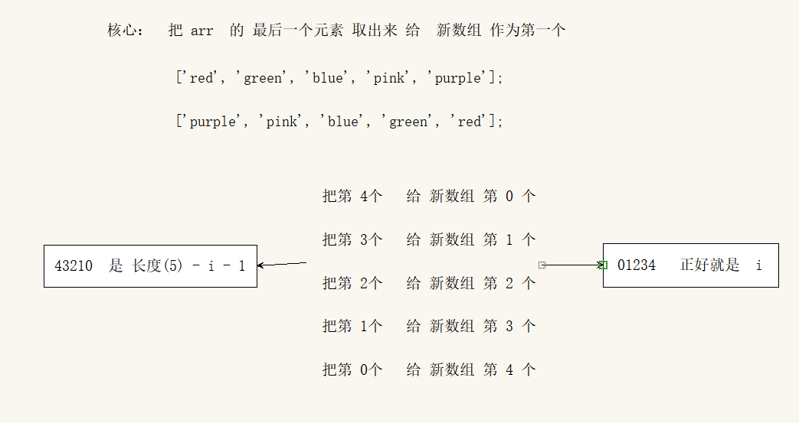
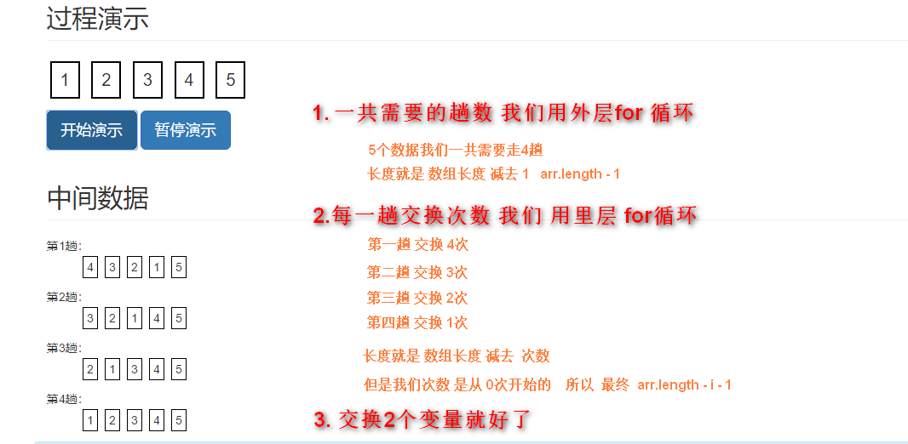

> 第02阶段.前端基本功.前端基础.进阶语法

# 数组

## 学习目标
* 理解
  * 数组的作用
  * 数组字面量
* 应用
  * 能创建和使用数组
  * 能遍历数组里面的元素
  * 能给数组排序

## 一.核心内容

## 1. 数组（重点）


### 1.1 为什么要有数组？

> 之前学习的数据类型，只能存储一个值。我们想存储班级中所有学生的姓名，此时该如何存储？

+ 数组的作用： 可以把一组相关的数据一起存放，并提供方便的访问(获取）方式。


### 1.2 什么是数组？

- 一组有序的数据

### 1.3 创建数组

#### 1.31 JS中创建数组分为2种：

- 通过new 方式 创建

​       var  数组名  =   new Array() ；

```
var arrStus01 = new Array();// 创建一个空新数组
```

- 通过字面量的形式

  字面量：  在源代码中一个固定值的表示法。

  通俗点   字面量表示如何表达这个值，一般除去表达式，给变量赋值时，等号右边都可以认为是字面量。

  数值字面量：8, 9, 10

  字符串字面量：'黑马程序员', "大前端"

  布尔字面量：true，false

  ~~~js
  var  数组名 =     [  ]
  ~~~


+ JS中存在字面量，可以更加方便的编写代码
+ 使用数组字面量 创建 **空数组**

```` js
//1.使用 数组字面量 方式创建 数组对象
var arrStus02 = [];
````

+ 使用数组字面量 创建 **带初始值数组**

```` js
使用 数组字面量 方式创建 带初始值数组对象
var arrStus02 = ['小白','小黑','大黄','瑞奇'];
````

### 1.4 数组元素的类型

+ 数组中可以存放任意类型的数据

```` js
var arrStus03 = ['小白',12,true,28.9];
````

**pink老师提问**

- 数组的作用是啥？
- 创建数组我们有哪两种方式？ 哪一种我们最常用？

### 1.5 设置和访问数组元素

+ **元素：**数组中每个空间里存放的数据

+ **下标 (索引) ：**用来访问数组空间的 **序号** （数组下标从 0 开始）

+ 数组可以通过 下标 来 访问、设置、修改 **对应下标空间** 里的元素。

  格式： 数组名[下标]

```` js
var arrStus = [1,2,3];

alert(arrStus[1]); // 2
````
pink老师提问：

- 什么是数组元素？
- 什么叫数组下标？
- 什么叫数组的索引号？
- 数组的索引号从几开始的？


 ~~~js
var arr =  ['刘备', '关羽', '张飞'];
想要获得 关羽 数据元素 怎么写？ 
arr[1]
 ~~~


> 课堂练习：
>
> 需求：    定义一个数组， 里面存放  星期一、星期二.... 直到星期天（共7天）， 并控制台输出 ： 今天是:  星期六；

### 1.6 数组的length属性

+ **数组.length**   用来访问数组里空间的数量（数组长度）

```` js
alert('arrStus数组包含的空间个数：' + arrStus.length); // arrStus数组包含的空间个数：3
````


### 1.7遍历数组所有成员

+ 数组中的每一项我们怎么取出来

```js
arrStus = ['大白很暖','有点儿意思','记得打call~！'];

第0项    arrStus[0]    // '大白很暖'   通过索引我们可以拿到数组中对应的值
第1项    arrStus[1]    // 有点儿意思
第2项    arrStus[2]    // 记得打call~！

规律：
我们发现 从数组中取出每一项  代码是重复的唯一不一样的就是 索引值在递增  
```

+ **遍历**就是把每个元素从头到尾都访问一次  （类似我们每天早上学生的点名）
+ 通过for循环下标遍历

```` js
 for (var i = 0; i < arr.length; i++) {
            console.log(arr[i]);
}
````
> **课堂案例** 
> 要求： 请将    ["关羽","张飞","马超","赵云","黄忠","刘备","姜维"];   数组里的 元素依次打印到控制台
~~~js
 var arr = ["关羽","张飞","马超","赵云","黄忠","刘备","姜维"]; 

        // 遍历  从第一个到最后一个的意思
        //alert(arr.length)

        for(var i = 0; i < arr.length; i++ )  { // i 一定是 0   因为我们的数组的索引号从 0 开始的

            // 数组的长度   通过数组的长度检测到就可以了

          console.log( arr[i] );
} 
~~~
**pink老师提问：**

- 什么是遍历？
- 数组我们通过什么来遍历里面的数据元素？
- for 里面 i  是什么  ？  
- 想要输出  数组  arr  里面的 第 i  个元素  怎么 写 ？ 


> **课堂案例**
> 要求：求一组数值 [2,6,1,7, 4]    的  和 还有 平均值  
~~~js
var arr = [2, 6, 1, 7, 4];
var sum = 0;
var average = 0;
for (var i = 0; i < arr.length; i++) {
    sum += arr[i];
}
average = sum / arr.length;
console.log('这组数的和是：' + sum);
console.log('这组数的平均值是：' + average);
~~~


> **课堂案例** (重点案例)
> 要求：求一组数值 [2,6,1,77,52,25,7] 的最大值
>
> 这个要求写思路：
>
> 知识点前置：  如何 比较2个数最大值 ？ 

```` js
var arr = [2, 6, 1, 77, 52, 25, 7];
// console.log(arr[0]);  -- 2

var max = arr[0];
for (var i = 1; i < arr.length; i++) {
    if (max < arr[i]) { // arr[i]  数组元素 
        max = arr[i] // max 里面存储的永远是最大值
    }
}
console.log(max); // 77
// 要求：求一个数组中 [2, 6, 1, 77, 52, 25, 7] 的最小值
````


> **课堂案例**
> 要求：将数组里面的数据转换为字符串

思路：  就是把里面的值相加 就好了，但是注意保证 是 字符相加。

1. 需要一个新变量用于存放 转换完的字符串。
2. 遍历原来的数组，分别把里面数据取出来， 加到 字符串里面

```js
var arr = ['red', 'green', 'blue', 'pink'];
var str = '';
for (var i = 0; i < arr.length; i++) {
    str += arr[i];
}
console.log(str);
```


> **课堂案例**
> 要求：将数组中的元素转换为字符串，  用|或其他符号分割

思路：

1. 需要一个新变量用于存放 转换完的字符串。
2. 遍历原来的数组，分别把里面数据取出来， 加到 字符串里面
3. 同时再后面多加一个  分隔符

```js
var arr = ['red', 'green', 'blue', 'pink'];
var str = '';
var separator = '|'
for (var i = 0; i < arr.length; i++) {
   str += arr[i] + separator;
}
console.log(str);
```
### 1.8 新增数组元素

+ JS 里的数组可以通过直接 访问 下标来实现扩容的目的

```` js
var arrStus03 = ['小白','小黑','大黄','瑞奇'];
````

 图解：通过初始化 创建了 4个空间大小的 数组

 


**一定 要用 数组加下标的方式 追加数组元素， 不能直接给数组名赋值， 否则会覆盖掉以前的数据。**

```` js
arrStus03[4] = '大白';
````

 图解：通过设置数组 第7个空间（下标6）  的值，数组自动添加了 3个 空间，已满足 访问第7个空间的目标

 

其中 第 4.5个空间 没有给值 ， 就是 声明变量未给值   默认的就是 undefined。

> 课堂案例
>

> 要求：要求将数组  [2, 0, 6, 1, 77, 0, 52, 0, 25, 7]  大于等于 10 的 元素选出来 ，放入 新数组
> 思路： 
>
> 1. 声明一个新的数组 用于存放  新数据
> 2. 遍历原来的数组 找出 大于等于10的元素
> 3. 依次追加给新数组

~~~js
var arr = [2, 0, 6, 1, 77, 0, 52, 0, 25, 7];
// 声明新的空数组
var newArr = [];
// 定义一个变量 用来计算 新数组的索引号
var j = 0;
for (var i = 0; i < arr.length; i++) {
    // 找出 大于 10 的数
    if (arr[i] >= 10) {
        // 给新数组
        newArr[j] = arr[i];
        // 索引号 不断自加
        j++;
    }
}
console.log(newArr);
~~~

> **课堂案例 数组去重 ** 
> 要求：要求将数组[2, 0, 6, 1, 77, 0, 52, 0, 25, 7]中的 0 去掉后 形成一个不包含 0 的新数组。
> 思路：

1. 需要一个新数组用于存放 筛选之后的数据。
2. 遍历原来的数组， 把不是0 的数据，添加到新数组里面( 此时要注意采用 数组名+下标 格式 接受数据)
3. 否知有空数据，我们新数组里面的个数，不断累加的用自己的length

```` js
var arr = [2, 0, 6, 1, 77, 0, 52, 0, 25, 7];
// 声明新的空数组
var newArr = [];
// 空数组的默认的长度为 0 
console.log(newArr.length);

// 定义一个变量 用来计算 新数组的索引号
for (var i = 0; i < arr.length; i++) {
    // 找出 大于 10 的数
    if (arr[i] != 0) {
        // 给新数组
        // 每次存入一个值， newArr长度都会 +1  
        newArr[newArr.length] = arr[i];
    }
}
console.log(newArr);
````

> **课堂案例（重点案例）**
> 要求，翻转数组，将数组   ['red', 'green', 'blue', 'pink', 'purple'] 的内容 反过来存放。

```` js
var arr = ['red', 'green', 'blue', 'pink', 'purple'];
var newArr = [];
for (var i = 0; i < arr.length; i++) {
    // newArr 一定是接受方    arr 是 输送方
    newArr[i] = arr[arr.length - i - 1];
}
console.log(newArr);
````



### 1.9 冒泡排序

   我们先复习下 如何把2个变量 交换数据  

~~~js
// 利用 第三个 变量
var num1 = 10;
var num2 = 20;
var temp = num1;
num1 = num2;
num2 = temp;
console.log(num1, num2);
~~~

​    冒泡排序：是一种算法,把一系列的数据按照一定的顺序进行排列显示(从小到大,从大到小）



~~~js
   var arr = [5, 4, 3, 2, 1];
        for (var i = 0; i < arr.length - 1; i++) {
            for (var j = 0; j < arr.length - i - 1; j++) {
                if (arr[j] > arr[j + 1]) {
                    var temp = arr[j];
                    arr[j] = arr[j + 1];
                    arr[j + 1] = temp;
                }
            }
        }
 console.log(arr);
~~~


### 1.10 小结

- 数组的 元素 可以是 任意类型
- 数组的 长度（容量） 是可变的
- 数组的 length 属性可读写


