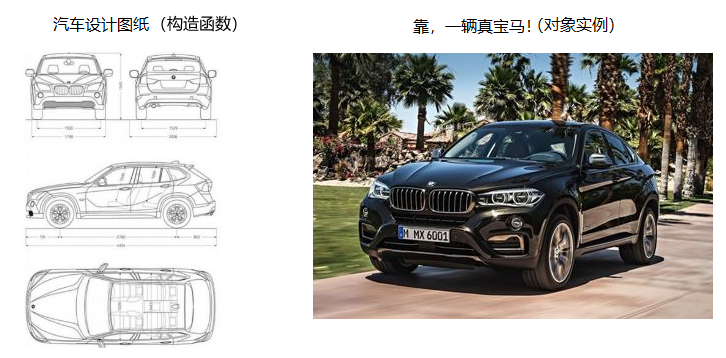

> 第02阶段.前端基本功.前端基础.进阶语法

# 对象(object)

## 学习目标
* 理解
  * 对象与对象实例的关系
  * 说出对象那些是属性那些是方法
  * 对象字面量
  * new 和 this 关键字
  * 值类型和引用类型内存分配
  * 学会查阅文档学习常见内置对象
* 应用
  * 能创建自己的对象
  * 能使用常见内置对象

## 一.核心内容

## 1. 对象(object)

### 1.1 什么是对象？

- 现实生活中：万物皆对象，对象是一个具体的事物。  看得见摸得着实物。一本书、一辆汽车、一个人都可以是“对象”，一个数据库、一张网页、一个与远程服务器的连接也可以是“对象”。
- 泛指    一大类  比如 说  苹果  就是泛指   类似其他语言的 类（class）
- 特指    某一个  比如说 这个苹果     我们说对象就是特指的，某一个。

**请说出下列哪个是 对象？**

~~~
汽车   飞机    明星    周星驰(星爷)    女朋友    迪丽热巴     班主任    助教     咱们班班主任 

苹果   这个苹果     手机    pink老师的这个手机     游戏    王者荣耀   
~~~

  

这个手机有啥特性? ---  在对象里面 外在特性 我们称为（名词）   属性  

颜色是黑色    尺寸  3寸    形状 是 方形    重量  


这个手机有啥功能？ -- 对象里面做 一些行为  （动词）    称为  方法

  打电话   发短信  玩游戏    砸脑袋 

 


华仔有啥特性?

 身高    体重    发型   肤色  


华仔有啥行为？  

 演电影   唱歌  跳舞  

### 1.2 为什么要有对象？

#### 1). 表达结构更清晰

我们保存一个值 我们用变量 

我们保存多个值（一组值） 我们用 数组

但是我们如果要保存一个人的完整信息

刘德华信息如下：  

~~~html
原名：刘福荣 

身高：174 

出生年：1961年 

生肖：牛  

祖籍：广东省江门市  

歌曲：  冰雨、恭喜发财等  

电影：  无间道、 天下无贼等 

~~~

如果你要用一个数组表示 ，别人一般是看不懂的。

var arr = ["刘德华", "牛", "冰雨","天下无贼"];

因为信息非常的复杂了，就不要用变量去存储了，这里我们可以用 复杂数据类型object 来存储复杂数据。

应该这样表示: 

~~~html
刘德华.生日 =  1961

刘德华.生肖 = 牛 

刘德华.唱歌() 

刘德华.演戏() 

~~~

这样来表达结构就很清楚了。

其中， 年龄  生肖  体重 身高这些 外在固定特性（一看就是名词） 我们称之为 **属性。**

唱歌、 演戏、 跳舞 这些 动作 （二看就是动词）我们称之为 **方法。**

属性和方法的区别是 属性不加括号，方法必定加上括号。

#### 2). 可以大量复用

回忆：当业务功能很多，代码量大的时候，为了复用代码，我们用 **函数** 来封装代码

那如果 函数很多、变量很多呢？--- 我们可以使用 **对象** 来封装  函数 和 变量

- **用 `对象` 封装 相关的 `属性` 和 `方法`**

  如：小白可以说 sayHi   大白也可以说， 以前的函数封装，我们只是封装了 属性，现在还可以封装方法了；

```js
var usrName = '小白';
var usrAge = 21;
var usrSex = true;

function sayHi(){
    alert('我的名字叫：'+ usrName + '，年龄：'+ usrAge + '，性别：'+ usrSex);
}

var usrName = '大白';
var usrAge = 100;
var usrSex = true;

function sayHi(){
    alert('我的名字叫：'+ usrName + '，年龄：'+ usrAge + '，性别：'+ usrSex);
}

var usrName = '白白';
var usrAge = 100;
var usrSex = true;

function sayHi(){
    alert('我的名字叫：'+ usrName + '，年龄：'+ usrAge + '，性别：'+ usrSex);
}
```

​	**优化：**因为可以为对象扩展属性和方法，我们现在 **可以用对象把 一组相关的 变量 和 函数 关联 起来**，访问和作为参数传递起来方便。如：

```js
function Person(name, age, sex) {
            this.name = name;  //  属性
            this.age = age;
            this.sex = sex;
            this.sayHi = function() {   // 方法
                alert('我的名字叫：' + this.name + '，年龄：' + this.age + '，性别：' + this.sex);
            }
 }
var bigbai = new Person('大白', 100, '男');
var smallbai = new Person('小白', 21, '男');
var baibai = new Person('小白', 21, '男');
```

> 在以后的项目中，会大量使用到对象来封装方法和属性。

### 1.3 创建对象

函数 封装了一组代码在里面

对象 封装了一组变量（ 属性）和 函数（方法） 

 #### 1）**对象字面量** 方式创建（重点  较为常用）

- **对象字面量：**是封闭在花括号对 `{}` 中的一个对象的0个或多个 `键:值` 无序列表
- **键：**相当于属性名
- **值：**相当于属性值，可以是任意类型的值（数值类型、字符串类型、布尔类型，甚至 函数类型）

```js
var star = {
    name : '刘德华',
    age : 18,
    sex : '男',
    sayHi : function(){
        alert('大家好啊~');
    }
};
```

**对象调用：**

* 对象里面的属性调用 :   **对象.属性名 **        这个小点 就理解为 的  
* 对象里面的属性另外调用方式 :   **对象['属性名'] **   注意  方括号里面的属性 必须加 引号   我们后面会用      
* 对象里面的方法调用： **对象.方法名()   **    注意这个方法名字后面一定加括号

~~~js
console.log(star.name)  // 调用 名字属性
console.log(star.age)  // 调用 年龄属性
star.sayHi();  // 调用 sayHi 方法   注意，一定不要忘记带后面的括号
~~~

**函数和方法的区别：**

* 函数是单独存在的，  调用的时候 函数名()  就可以了   
* 方法是再对象里面，  调用的时候，对象.方法名()     

使用基本是一致的。

> 课堂案例：
>
> 请用对象字面量的形式创建 一个  王可可 的狗对象。   具体信息如下：  王可可   是一条   阿拉斯加犬(type)， 今年5岁了， 颜色是 红色。    它会 汪汪汪(cry)     它 会 演电影 《后会无期》(showFilm)

 

#### 2） new Object 创建对象

```js
var stuObj = new Obect();
stuObj.name = 'james';
stuObj.age = 11;
stuObj.sex = true;
stuObj.sayHi = function(){
    alert('大家好啊~');
}
```

* 跟我们前面学的  new Array()  一样。
* Object()   是构造函数   第一个字母大写   
* new Object()  是调用构造函数   因为构造函数需要new 来调用   同时再内存中创建一个对象
* 注意里面使用的时候用点  不是  冒号  

> 课堂案例
>
> 创建一个 手机对象   型号(type)  iphone xx      颜色是 黑色   大小（size) 5.5寸    可以 发短信 (sendMessage)  输出   吃大肘子      可以  打电话（call)   说  全聚德吃烤鸭   

**缺点：**

  每次都创建一个对象，还是存在大量的 重复代码，  并没有节约代码。

### 1. 4 自定义构造函数

我们可以和以前封装函数一样， 想创建多个对象，不用一个个的创造对象了。

抽象可以将具有相同或相似功能的js代码独立出来封装成一个函数，这样可以提高代码的重复利用率，提高代码书写的效率，也可以有效的减少代码的冗余。

我们这个函数里面封装的对象， 为了和以前区别显示不同。 我们称为 构造函数。

> 构造函数 ，是一种特殊的函数。主要用来在创建对象时初始化对象， 即为对象成员变量赋初始值，总与new运算符一起使用在创建对象的语句中。

1. 构造函数用于创建某一大类对象，首字母要大写。
2. 构造函数要和new一起使用才有意义。

~~~js
function Person(name, age, sex) {
     this.name = name;
     this.age = age;
     this.sex = sex;
     this.sayHi = function() {
          alert('我的名字叫：' + this.name + '，年龄：' + this.age + '，性别：' + this.sex);
    }
}
var bigbai = new Person('大白', 100, '男');
var smallbai = new Person('小白', 21, '男');
console.log(bigbai.name);
console.log(smallbai.name);
~~~

> 课堂练习
>
> 利用构造函数 创建一个英雄 对象。    里面有   姓名 属性 (name),    类型属性（type），  血量属性（blood），    具有 攻击方法（attack）
>
> 使用的英雄  ：   
>
> 廉颇        力量型    100血量       攻击  
>
>  后羿        射手型    100血量      攻击

**构造函数和对象（实例）**

1. Stars()是构造函数 主要是 初始化对象 用的。泛指某一大类   类似其他语言的 类 （class）  比如  苹果  一个 大类      类似  `汽车图纸`（包含 我们写好的 代码和数据 的模板） 

2. new Stars()   创建对象 用的。特指某一个    咱们前面指的   这个咬了一口的 苹果， 就是对象了。  

    是通过 `new关键字`  创建对象的过程 我们也称为  对象实例化。 

   宝马汽车就是 `汽车对象` 的一个 `实例 ` 。



### 1.5 new关键字

~~~js
function Student(name, age) {
    this.name = name;
    this.age = age;
    this.sayHi = function() {
        alert(this.name + '你好');
    }
}
var lilei = new Student('李雷', 18);
var hanmm = new Student('韩梅梅', 17);
console.log(lilei.name);
lilei.sayHi();
~~~

new在执行时会做四件事情

```
new会在内存中创建一个新的空对象
new 会让this指向这个新的对象
执行构造函数里面的代码  目的：给这个新对象加属性和方法
new会返回这个新对象 （所以构造函数里面不需要return）
```

### 1.6 this详解

```
JavaScript中的this指向问题，有时候会让人难以捉摸，随着学习的深入，我们可以逐渐了解
现在我们需要掌握函数内部的this几个特点
	1. 函数在定义的时候this是不确定的，只有在调用的时候才可以确定
	2. 一般函数直接执行，内部this指向全局window
	3. 函数作为一个对象的方法，被该对象所调用，那么this指向的是该对象（谁调用指向谁）
	4. 构造函数中的this  对象的实例  

```

~~~js
// 1. 普通函数
function fn() {
    console.log(this); // this 指向 window
 }
fn();
 // 2 对象方法
var obj = {
    name: 'zs',
    dance: function() {
         console.log(this);
         that = this;
}
}
obj.dance(); //  this 指向 obj  
console.log(that === obj); // true
// 3 构造函数
function Fn() {
    this.age = '18';
    console.log(this)
    self = this;
}
var demo = new Fn(); // this  指向 demo
console.log(self === demo); // true

~~~

### 1.7 小结

对象 是 封装了 相关 属性 和 方法 的 复杂数据类型

本质：对象就是一组 无序的 **相关属性和方法** 的 **集合**

注意： `函数` 用来按功能 **封装代码**，`对象` 用来按功能 **封装方法和属性**，都起到复用代码和数据的作用

- 构造函数   泛指  某一大类    比如 苹果    不管红色苹果还是 绿色苹果都是统称为 苹果  类似其他语言的类

- 对象实例   特指  一个事务  比如 这个苹果    正在给你们讲课的pink老师

  通俗：实例 就是按照汽车设计图纸 造一辆辆的车

  概念：实例 是 某种对象类型 的一个具体存在

  本质：实例 就是根据对象模板 创造 的一个对象实体

### 1.8 遍历对象的属性

> for...in 语句用于对数组或者对象的属性进行循环操作。

```javascript
for (变量 in 对象名字) {
    在此执行代码
}
```

* 这个变量是自定义 符合命名规范  但是一般我们 都写为 k  或则  key
* 后面的是对象 可以  数组     因为 数组也属于对象 

#### 1） for in 遍历 对象

~~~js
var obj = {
     name: 'andy',
     age: 18,
     sex: '男'
}
console.log(obj.length); // undefined
for (var k in obj) {
    console.log(k); // 这里的k 是属性名
    console.log(obj[k]); // 这里的 obj[k] 是属性值
}
~~~

* 再对象里面， 这里的k  是 属性名  

### 1.9 遍历 JSON格式

**JSON**(JavaScript Object Notation) 是一种轻量级的数据交换格式。 易于人阅读和编写。

1. JSON 数据的书写格式是：名称/值对。
2. 里面的属性和值都要用 双引号 括起来

~~~
 var json = {
     "id": "1",
     "name": "andy",
      "age": "18",
      "tel": "110120"
 }
 for (var k in json) {
    console.log(k); // 这里的k 是属性名
    console.log(obj[k]); // 这里的 obj[k] 是属性值
}
~~~


## 2. 内置对象

JavaScript中的对象分为3种：内置对象、自定义对象 、 浏览器对象

内置对象就是指JS语言自带的一些对象，供开发者使用，这些对象提供了一些常用的或是最基本而必要的功能

JavaScript 提供多个内置对象：Math/Array/Number/String/Boolean...

对象只是带有**属性**和**方法**的特殊数据类型。

学习一个内置对象的使用，只要学会其常用的成员的使用（通过查文档学习）

可以通过MDN/W3C来查询

内置对象的方法很多，我们只需要知道内置对象提供的常用方法，使用的时候查询文档。

### 2.1 MDN

Mozilla 开发者网络（MDN）提供有关开放网络技术（Open Web）的信息，包括 HTML、CSS 和万维网及 HTML5 应用的 API。

- [MDN](https://developer.mozilla.org/zh-CN/)
- 学会通过MDN 来 查询需要的内容

### 如何学习对象中的方法？

1. 方法的功能
2. 参数的意义和**类型**
3. 返回值意义和**类型**
4. demo进行测试

### 2.2 Math对象

Math对象不是构造函数，它具有数学常数和函数的属性和方法。

跟数学相关的运算来找Math中的成员（求绝对值，取整）

[Math](https://developer.mozilla.org/zh-CN/docs/Web/JavaScript/Reference/Global_Objects/Math)

注意以下都是方法  所以 必须带括号

演示：Math.PI、Math.random()、Math.floor()/Math.ceil()、Math.round()、Math.abs()	、Math.max()

```javascript
Math.PI						// 圆周率
Math.floor() 	              // 向下取整
Math.ceil()                   // 向上取整
Math.round()				// 四舍五入版 就近取整   注意 -3.5   结果是  -3 
Math.abs()					// 绝对值
Math.max()/Math.min()		 // 求最大和最小值
Math.sin()/Math.cos()		 // 正弦/余弦
Math.power()/Math.sqrt()	 // 求指数次幂/求平方根
```

#### Math.random 生成随机数

随机返回一个小数 ，  取值范围 是  范围**[0，1)**        左闭右开     0  <= x  < 1   

~~~js
console.log(Math.random()); // 0.40645855054029756
~~~

#### 案例

> 课堂案例
>
> 要求：求10-20（包含10和20）之间的随机整数

~~~js
// 分析公式
// 1. math.random()   [0, 1)  0 <= x  < 1   这是最恶心的
// 2.  Math.random() * (max - min + 1)   公式  注意先计算乘数
// 3. 带入数据
// 4. Math.random() * (20 - 10 + 1)
// 5.  Math.random() * (11)  
// 6.  [0, 1) * 11   ==>  [0, 11)  
// 7. [0, 11)  + min     ==>  [0, 11) + 10  ==>  [10, 21)
// 8. Math.floor([10, 21));  ==> [10, 20]
// Math.floor(Math.random() * (max - min + 1) + min)

function getRandom(min, max) {
   return Math.floor(Math.random() * (max - min + 1) + min);
}
console.log(getRandom(10, 20))
~~~

> 课堂案例
>
> 要求： 随机生成颜色RGB

```js
function getRandom(min, max) {
    return Math.floor(Math.random() * (max - min + 1) + min);
}

function getRGB(min, max) {
    var c1 = getRandom(min, max);
    var c2 = getRandom(min, max);
    var c3 = getRandom(min, max);
    return 'rgb(' + c1 + ', ' + c2 + ', ' + c3 + ')';
}
console.log(getRGB(0, 255));
```

> 
>

> 课堂案例
>
> 利用对象 模拟 max  和  min  


~~~js
var myMath = {
    PI: 3.141592653,
    max: function() {
        var max = arguments[0];
        for (var i = 0; i < arguments.length; i++) {
            if (max < arguments[i]) {
                max = arguments[i];
            }
        }
        return max;
    },
    min: function() {
        var min = arguments[0];
        for (var i = 0; i < arguments.length; i++) {
            if (min > arguments[i]) {
                min = arguments[i];
            }
        }
        return min;
    }
};

console.log(myMath.max(1, 6, 8, 9));
console.log(myMath.min(1, 6, 8, 9));

~~~


### 2.3 作业

~~~
创建一个电脑对象,有颜色,有重量,有品牌,有型号,可以看电影,可以听音乐,可以打游戏,可以敲代码

创建一个按钮对象,宽,高,背景颜色,点击行为

创建一个车的对象,有重量,颜色,牌子,可以载人,拉货， 耕田

练习1：简单的随机点名，刷新页面随机出现一个人的名字 （思路 把所有名字放到一个数组里面， 随机找出来）

练习2：随机颜色值，

练习3： 随机生成16进制的颜色

练习4： 倒计时

~~~

> 课后作业
>
> 要求： 随机生成十六进制颜色

```js
function getRandom(min, max) {
    return Math.floor(Math.random() * (max - min + 1) + min);
}

function getColor() {

    var arr = ['0', '1', '2', '3', '4', '5', '6', '7', '8', '9', 'a', 'b', 'c', 'd', 'e', 'f'];
    var str = '#';
    for (var i = 0; i < 6; i++) {
        str += arr[getRandom(0, 15)];
    }
    return str;
}
console.log(getColor());
```


### 2.4 Date对象

Date对象 和 Math 对象不一样，他是一个构造函数。  所以我们需要 实例化使用。

创建 `Date` 实例用来处理日期和时间。Date 对象基于1970年1月1日（世界标准时间）起的毫秒数。

[为什么计算机起始时间从1970年开始](https://www.zhihu.com/question/27005396/answer/34868386)

#### 1）Date() 的使用

```javascript
// 获取当前时间，
var now = new Date();
console.log(now);	

Date构造函数的参数
// 括号里面时间 ，就返回 参数里面的时间
日期格式字符串  '2015-5-1'	 new Date('2015-5-1')  或者  new Date('2015/5/1') 

```

总结：

* 如果Date()不写参数，就返回当前时间
* 如果Date()里面写参数，就返回 括号里面输入的时间

#### 2）获取日期的毫秒形式

Date 对象基于1970年1月1日（世界标准时间）起的毫秒数。

[为什么计算机起始时间从1970年开始](https://www.zhihu.com/question/27005396/answer/34868386)

```javascript
 // 注意他们都是方法
var now = new Date();
// valueOf用于获取对象的原始值
console.log(date.valueOf())	
console.log(date.getTime())	

// 简单写可以这么做
var now = + new Date();			

// HTML5中提供的方法，有兼容性问题
var now = Date.now();	
```

#### 3）日期格式化方法

我们想要 2018-8-8  8:8:8    格式怎么办？ 

- 获取日期指定部分

  所以我们手动的得到这种格式。

| 方法名        | 说明                         | 代码               |
| ------------- | ---------------------------- | ------------------ |
| getFullYear() | 获取当年                     | dObj.getFullYear() |
| getMonth()    | 获取当月（0-11）             | dObj.getMonth()    |
| getDate()     | 获取当天日期                 | dObj.getDate()     |
| getDay()      | 获取星期几 （周日0 到周六6） | dObj.getDay()      |
| getHours()    | 获取当前小时                 | dObj.getHours()    |
| getMinutes()  | 获取当前分钟                 | dObj.getMinutes()  |
| getSeconds()  | 获取当前秒钟                 | dObj.getSeconds()  |

* 注意 月份 和星期  取值范围是从  0开始的。

#### 案例

* 2018年5月29日 星期二     请写出这个格式

  ~~~js
  function getMyDate() {
      var arr = ['星期天', '星期一', '星期二', '星期三', '星期四', '星期五', '星期六'];
      var date = new Date();
      // 2018年5月29日 星期二 
      var str = date.getFullYear() + '年' + (date.getMonth() + 1) + '月' + date.getDate() + '日 ' + arr[date.getDay()];
      return str;
  }
  console.log(getMyDate());
  ~~~

  ​

- 写一个函数，格式化日期对象，HH:mm:ss 的形式   比如  00:10:45

~~~js
function getTimer() {
    var date = new Date();
    // var str = date.getHours() + ':' + date.getMinutes() + ':' + date.getSeconds();
    var h = date.getHours();
    var m = date.getMinutes();
    var s = date.getMinutes();
    // if(h < 0) {
    //     h = '0' + h;
    // }
    h = h < 10 ? '0' + h : h
    m = m < 10 ? '0' + m : m
    s = s < 10 ? '0' + s : s
    return h + ':' + m + ':' + s;
}
console.log(getTimer());

~~~

- 做一个倒计时效果

  计算公式：

​        d = parseInt(总秒数/ 60/60 /24); // 计算天数
​        h = parseInt(总秒数/ 60/60 %24) // 计算小时
​        m = parseInt(总秒数 /60 %60 ); // 计算分数
​        s = parseInt(总秒数%60);  // 计算当前秒数 


```javascript
function getCountTime(endTime) {
    var d, h, m, s;
    //1. 用用户输入的时间 减去 开始的时间就是 倒计时 
    //2. 但是要注意，我们得到是 毫秒数  然后 把这个毫秒数转换为 相应的 天数 时分秒 就好了
    var countTime = parseInt((new Date(endTime) - new Date()) / 1000);
    // console.log(countTime);
    // 3. 把得到的毫秒数 转换 当前的天数 时分秒
    console.log(countTime);

    d = parseInt(countTime / 60 / 60 / 24); // 计算天数

    h = parseInt(countTime / 60 / 60 % 24); // 计算小时

    m = parseInt(countTime / 60 % 60); // 计算分数

    s = parseInt(countTime % 60); // 计算当前秒数 
    return '还剩下' + d + '天' + h + '时' + m + '分' + s + '秒 ';
}
console.log(getCountTime('2018-5-30 17:30'));
```

### 2.5 基本包装类型（理解）

为了方便操作基本数据类型，JavaScript还提供了三个特殊的引用类型：String/Number/Boolean

基本包装类型就是 把简单数据类型包装成为复杂数据类型。 这样 基本数据类型就有了属性和方法

```javascript
// 下面代码的问题？
var str = 'andy';
console.log(str.length);
// 按道理 基本数据类型 是 没有属性和方法的
// 对象才有属性和方法的
// 这个原因是因为， js 会把 基本数据类型包装为复杂数据类型
//  执行过程如下  生成临时变量 把简单类型包装为复杂数据类型
var temp = new String('andy');
// 赋值给 我们声明的 字符变量
str = temp;
// 销毁给临时变量
temp = null;
```


### 2.6 String对象

- 字符串的不可变  指的是里面的值不可变，  看上去可以改变内容，其实是地址变了，新开辟了一个内存空间。

```javascript
var str = 'abc';
str = 'hello';
// 当重新给str赋值的时候，常量'abc'不会被修改，依然在内存中
// 重新给字符串赋值，会重新在内存中开辟空间，这个特点就是字符串的不可变
// 由于字符串的不可变，在大量拼接字符串的时候会有效率问题
var str = '';
for (var i = 0; i < 100000; i++) {
    str += i;
}
console.log(str); // 这个结果需要花费大量时间 来 显示 因为需要不断的开辟新的空间
```

- 创建字符串对象

```javascript
var str = 'andy';
console.log(str); // 看不到常见的属性和方法
var str1 = new String('andy');
console.log(str1); // 可以看到常见的属性和方法
// 但是字符串经过基本包装类， 是可以使用 常见的属性和方法
```

#### 字符串对象的常用方法

字符串所有的方法，都不会修改字符串本身(字符串是不可变的)，操作完成会返回一个新的字符串

#### 1) 根据位置获取字符

| 方法名            | 说明                                      | 使用                           |
| ----------------- | ----------------------------------------- | ------------------------------ |
| charAt(index)     | 返回指定位置的字符(index 字符串的索引号)  | str.charAt(0)                  |
| charCodeAt(index) | 获取指定位置处字符的ASCII码 (index索引号) | str.charCodeAt(0)              |
| str[index]        | 获取指定位置处字符                        | HTML5，IE8+支持 和charAt()等效 |
~~~js
var str = 'andy';
console.log(str.charAt(0)); // a
// 可以遍历的方法 得到所有的字符串
for (var i = 0; i < str.length; i++) {
    console.log(str[i]);
}

~~~

#### 2) 字符串操作方法

| 方法名                    | 说明                                                         |
| ------------------------- | ------------------------------------------------------------ |
| concat(str1,str2,str3...) | concat() 方法用于连接两个或多个字符串。拼接字符串，等效于+，+更常用 |
| substr(start,length)      | 从start位置开始（索引号） ， length  取的个数   重点记住这个 |
| slice(start, end)         | 从start位置开始，截取到end位置，end取不到 (他们俩都是索引号) |
| substring(start, end)     | 从start位置开始，截取到end位置，end取不到   基本和slice 相同 但是不接受负值 |
```javascript
var str1 = 'andy';
var str2 = 'red';
console.log(str1.concat(str2, '肖申克救赎'));  // andyred肖申克救赎

var str = 'my name is andy';
console.log(str.substr(1)); // y name is andy  默认从第1个到最后
console.log(str.substr(0, 2)); // my 从第0个开始，取2个
console.log(str.substr(3, 7)); //name  is 从第 3个索引号开始，取 7个


var str = 'my name is andy';
console.log(str.slice(1)); // y name is andy  默认从第1个到最后
console.log(str.slice(0, 2)); // my 从第0个开始，取到 第 1个（不包含2）
console.log(str.slice(3, 7)); // name

var str = 'my name is andy';
console.log(str.substring(1)); // y name is andy  默认从第1个到最后
console.log(str.substring(0, 2)); // my 从第0个开始，取到 第 1个（不包含2）
console.log(str.substring(3, 7)); // name
```

- 截取字符串"我爱中华人民共和国"，中的"中华"

```javascript
var s = "我爱中华人民共和国";
s = s.substr(2,2);
console.log(s);
```

#### 3) 获取字符串位置方法

| 方法名                              | 说明                                                         |
| ----------------------------------- | ------------------------------------------------------------ |
| indexOf('要查找的字符', 开始的位置) | 返回指定内容在元字符串中的位置， 如果找不到就返回 -1，开始的位置是index 索引号 |
| lastIndexOf()                       | 从后往前找，只找第一个匹配的                                 |

~~~js
var str = 'my name is andy';
console.log(str.indexOf('n')); // 3
console.log(str.indexOf('l')); // -1
~~~

- "abcoefoxyozzopp"查找字符串中所有o出现的位置

```javascript
var str = 'abcoefoxyozzopp';
// 因为里面 index 要加1 所以这里是 -1
var index = -1;
do {
    // 这里判断是否能取到 o
    index = str.indexOf('o', index + 1);
    // 如果不是-1 就返回这个位置
    if (index != -1) {
        console.log(index);
    }
} while (index !== -1)
```

#### 4） replace() 替换

replace() 方法用于在字符串中用一些字符替换另一些字符

格式如下：  

replace(被替换的字符串， 要替换为的字符串)；

- 把字符串中所有的o替换成!

```javascript
var s = 'abcoefoxyozzopp';
while (s.indexOf('o') !== -1) {
    s = s.replace('o', '!');
}
console.log(s);
```

- 判断一个字符串中出现次数最多的字符，统计这个次数

```javascript
var s = 'abcoefoxyozzopp';
var o = {};

for (var i = 0; i < s.length; i++) {
  var item = s.charAt(i);
  if (o[item]) {
    o[item] ++;
  }else{
    o[item] = 1;
  }
}

var max = 0;
var char ;
for(var key in o) {
  if (max < o[key]) {
    max = o[key];
    char = key;
  }
}

console.log(max);
console.log(char);
```

#### 5） 转换大小写

toUpperCase() 	//转换大写
toLowerCase() 	//转换小写

~~~js
var str = 'ANDY';
console.log(str.toLowerCase()); // andy
var str = 'andy';
console.log(str.toUpperCase()); // ANDY
~~~


#### 6) split 切割字符串

注意，切割完毕之后，返回的是一个新数组

~~~js
var str = 'a,b,c,d';
console.log(str.split(',')); //返回的是一个数组 [a, b, c, d]
~~~


#### 作业

```
给定一个字符串如：“abaasdffggghhjjkkgfddsssss3444343”问题如下： 
1、 字符串的长度 
2、 取出指定位置的字符，如：0,3,5,9等 
3、 查找指定字符是否在以上字符串中存在，如：i，c ，b等 
4、 替换指定的字符，如：g替换为22,ss替换为b等操作方法 
5、 截取指定开始位置到结束位置的字符串，如：取得1-5的字符串
6、 找出以上字符串中出现次数最多的字符和出现的次数 
7、 遍历字符串，并将遍历出的字符两头添加符号“@”输出至当前的文档页面。 
```


### 2.7 Array对象

- 创建数组对象的两种方式
  - 字面量方式
  - new Array()

```javascript
//    空数组 
var arr = new Array(); 
// 数组长度为3 但是内容为空
var arr = new Array(3); 
// 创建数组  [3,4,6]
var arr = new Array(3, 4, 6); 

// 2. 使用字面量创建数组对象
var arr = [1, 2, 3];

// 获取数组中元素的个数
console.log(arr.length);
```

- 检测一个对象是否是数组

  - instanceof
  - Array.isArray()     HTML5中提供的方法，有兼容性问题

  函数的参数，如果要求是一个数组的话，可以用这种方式来进行判断

  ~~~js
  var arr = [1, 23];
  var obj = {};
  console.log(arr instanceof Array); // true
  console.log(obj instanceof Array); // false
  console.log(Array.isArray(arr)); // true
  console.log(Array.isArray(obj)); // false
  ~~~

- toString()

  toString()	 把数组转换成字符串，逗号分隔每一项  跟我们讲过的  split 相反

  ~~~js
  var arr = [1, 2, 3, 4, 5];
  console.log(arr.toString()); // 字符型 的 1,2,3,4,5
  ~~~

- 数组常用方法

  演示：push()、shift()、unshift()、reverse()、sort()、splice()、indexOf()

####  1）数组添加删除方法

| 方法名            | 说明                                                | 返回值               |
| ----------------- | --------------------------------------------------- | -------------------- |
| push(参数1....)   | 修改原数组，末尾添加一个或多个元素                  | 并返回新的长度       |
| pop()             | 删除 数组的最后一个元素，把数组长度减 1 无参数      | 返回它删除的元素的值 |
| unshift(参数1...) | 向数组的开头添加一个或更多元素                      | 并返回新的长度       |
| shift()           | 把数组的第一个元素从其中删除，把数组长度减 1 无参数 | 并返回第一个元素的值 |

~~~js
// push
var arr = ['pink', 'deeppink', 'hotpink'];
console.log(arr.push('lightpink')); //  返回数组长度  4
console.log(arr); //  ['pink', 'deeppink', 'hotpink', 'linghtpink']

// pop
var arr = ['pink', 'deeppink', 'hotpink'];
console.log(arr.pop()); // 返回删除的那1个元素  'hotpink'
console.log(arr); // 返回删除的那1个元素  ["pink", "deeppink"]

// unshift
var arr = ['pink', 'deeppink', 'hotpink'];
console.log(arr.unshift('lightpink')); //  返回数组长度  4
console.log(arr); //  ['linghtpink','pink', 'deeppink', 'hotpink']

// shift 
var arr = ['pink', 'deeppink', 'hotpink'];
console.log(arr.shift()); // 返回删除的那1个元素  'pink'
console.log(arr); // 返回删除的那1个元素  ["deeppink", "hotpink"]
~~~

* 工资的数组[1500, 1200, 2000, 2100, 1800],把工资超过2000的删除

~~~js
var arr = [1500, 1200, 2000, 2100, 1800];
var newArr = [];
for (var i = 0; i < arr.length; i++) {
    if (arr[i] < 2000) {
        newArr.push(arr[i]);
    }
}
console.log(newArr);
~~~


#### 2）数组排序方法

| 方法名    | 说明                        | 是否修改原数组         |
| --------- | --------------------------- | ---------------------- |
| reverse() | 颠倒数组中元素的顺序,无参数 | 该方法会改变原来的数组 |
| sort()    | 对数组的元素进行排序        | 该方法会改变原来的数组 |

~~~js
// reverse 
var arr = ['red', 'andy'];
console.log(arr.reverse()); // 返回翻转之后的数组
console.log(arr); // 原先数组也被修改
~~~


sort  如果调用该方法时没有使用参数，按照字符编码的顺序进行排序。 

~~~js
var arr = [1, 64, 9, 6];
arr.sort(function(a, b) {
    return b - a; // 降a序
    // return a - b;   升序
});
console.log(arr);
~~~

#### 3) 数组操作方法

| 方法名   | 说明                                  | 返回值                                         |
| -------- | ------------------------------------- | ---------------------------------------------- |
| concat() | 连接两个或多个数组                    | 返回一个新的数组                               |
| slice()  | 数组截取slice(begin, end)             | 返回被截取项目的新数组                         |
| splice() | 数组删除splice(第几个开始,要删除个数) | 返回被删除项目的新数组  注意，这个会影响原数组 |

~~~js
var arr1 = [1, 2];
var arr2 = ['pink', 'red'];
var arr3 = ['andy', 18];
//返回连接之后的新数组
console.log(arr1.concat(arr2, arr3));

// arr.slice(begin, end)   begin (包含自己） 和  end (不包含)  都是 索引号   
var arr = ['red', 'green', 'blue', 'pink'];
console.log(arr.slice()); // 默认截取整个数组
console.log(arr.slice(0)); // 从第0个截取到最后
console.log(arr.slice(0, 3)); // 从第0个截取  截取 索引号是3的但是不包含3

// splice 删除
var arr = ['red', 'green', 'blue', 'pink'];
console.log(arr.splice(2, 1)); // 从索引号2开始  删除1个 blue
console.log(arr); // 修改 原数组 ["red", "green", "pink"]

~~~
- 清空数组

~~~javascript
// 方式1 推荐 

arr = [];

// 方式2 

arr.length = 0;

// 方式3

arr.splice(0, arr.length);

~~~


#### 4) 数组位置方法

| 方法名        | 说明               | 返回值                 |
| ------------- | ------------------ | ---------------------- |
| indexOf()     | 连接两个或多个数组 | 返回一个新的数组       |
| lastIndexOf() | 如果没找到返回-1   | 返回被截取项目的新数组 |


#### 5) 数组的所有元素连接到一个字符串中

| 方法名         | 说明                                         | 返回值         |
| -------------- | -------------------------------------------- | -------------- |
| join('分隔符') | 方法用于把数组中的所有元素转换为一个字符串。 | 返回一个字符串 |

~~~js
var arr = ['red', 'green', 'blue', 'pink'];
console.log(arr.join()); // 跟toString() 一样， 转换为字符串
console.log(arr.join('-')); //red-green-blue-pink
~~~


#### 6）迭代方法   

| 方法名   | 说明             | 返回值 |
| -------- | ---------------- | ------ |
| filter() | 按照条件筛选数组 |        |
|          |                  |        |

* filter()语法

  ~~~js
  arr.filter(callback[, thisArg])
  ~~~


~~~js
var arr = [1500, 1200, 2000, 2100, 1800];
arr.filter(function(item) {
    // item 是个形参   包含了 每个  数组值
    console.log(item);
})

// 最终使用
var arr = [1500, 1200, 2000, 2100, 1800];
var resu = arr.filter(function(item) {
    // item 是个形参   包含了 每个  数组值
    return item < 2000
})
console.log(resu);

~~~

- 编写一个方法去掉一个数组的重复元素（重点案例必须掌握的）

```javascript
var arr = ['c', 'a', 'z', 'a', 'x', 'a'];
var arr = ['c', 'a', 'z', 'a', 'x', 'a', 'x', 'c', 'b'];
var o = {};
for (var i = 0; i < arr.length; i++) {
    var item = arr[i];
    if (o[item]) {
        o[item]++;
    } else {
        o[item] = 1;
    }
}
console.log(o);
// 声明一个新数组
var newArr = [];
for (k in o) {
    // 如果值是1的话， 说明只有一次，我们可以直接存储到新数组里面
    // 或者 这个数组里面没有重复的
    if (o[k] === 1 || newArr.indexOf(k) === -1) {
        newArr.push(k);
    }
}
console.log(newArr);
```

重点案例（现在理解，后面一定回回来的）：

 var url = 'http://www.itheima.com/login?name=zs&age=18';

~~~js
var url = 'http://www.itheima.com/login?name=zs&age=18';

function getParams(url) {
    // 1. 首先把 网址分为2部分  用 ? 分割 
    // 2. 得到 ？+ 1 的索引位置
    var index = url.indexOf('?') + 1;
    // 3. 得到 ？ 后面的字符串
    var params = url.substr(index);
    console.log(params); // name=zs&age=18
    // 4. 把 得到 这串字符 继续用 & 分隔开
    var arr = params.split('&');
    // console.log(arr);
    var o = {};
    // 5. 把 数组里面的每一项，继续用 = 分割
    for (var i = 0; i < arr.length; i++) {
        var newArr = arr[i].split('=');
        // console.log(newArr);
        // 完成赋值 操作
        o[newArr[0]] = newArr[1];
    }
    return o;
}
console.log(getParams(url));
~~~


建议看看的方法：

every()、、forEach()、map()、some()

## 3. 简单类型和复杂类型

> 简单类型又叫做基本数据类型或者值类型，复杂类型又叫做引用类型
>
> 值类型：简单数据类型/基本数据类型，在存储时，变量中存储的是值本身，因此叫做值类型。
>
> 引用类型：复杂数据类型，在存储是，变量中存储的仅仅是地址（引用），因此叫做引用数据类型。

### 3.1 堆 和 栈

堆栈空间分配区别：
　　1、栈（操作系统）：由操作系统自动分配释放 ，存放函数的参数值，局部变量的值等。其操作方式类似于数据结构中的栈；
　　2、堆（操作系统）： 存储复杂类型(对象)，一般由程序员分配释放， 若程序员不释放，由垃圾回收机制回收。


### 3.1 值类型内存分配

- 值类型（简单数据类型）： string ，number，boolean，undefined，null

- **值类型变量** 的 数据 直接存放在变量（栈空间）中，如图：

   

```js
var  n1 = 10; 
var n2 = 20;
n1 = n2; 
此时   n1  结果为  20     n2  的值 还是  20  
```

### 3.2 引用类型内存分配

- 引用类型（复杂数据类型）：通过 new 关键字创建的对象（系统对象、自定义对象）

- **引用类型变量**（栈空间）里存放的是**地址**，真正的对象实例存放在堆空间中，如图：

   

  > 执行代码时，new 的对象实例 被创建在堆空间中，堆地址通过 = 号 赋值到变量 usrObj 的栈空间中。


- 我们通过变量 usrObj 访问 Object对象实例 里的内容时，实际是通过 栈空间里存放的堆地址来找到对象实例，再调用对象实例里的成员。

```js
function Person(name, age) {
   this.name = name;
   this.age = age;
 }
var p1 = new Person('andy', 55);
var p2 = p1;
p1.name = 'red';
console.log(p2.name);  
```

### 3.3 值类型传参

> 思考以下代码结果：

```js
function fn(a) {
    a++;
    console.log(a); 
}
var x = 10;
fn(x);
console.log(x)；
```

- 结论：函数的形参也可以看做是一个变量，当我们把一个值类型变量作为参数传给函数的形参时，其实是把变量在栈空间里的值 复制 了一份给形参，那么在方法内部对形参做任何修改，都不会影响到的外部变量

  ​

### 3.4 引用类型传参

> 思考以下代码的结果：

```js
// 下面代码输出的结果?
function Person(name) {
  this.name = name;
}
function f1(x) {
  x.name = "ls";
}
var p = new Person("zs");
console.log(p.name);  // ?
f1(p);
console.log(p.name);  // ?  
```

如果更换呢？

```js
// 下面代码输出的结果?
function Person(name) {
  this.name = name;
}
function f1(x) {
  x.name = "ls";
  x = new Person("aa");
   console.log(x.name);  // ?
}

var p = new Person("zs");
console.log(p.name);  // ?
f1(p);
console.log(p.name); // ?
```


- 图解分析：


- 结论：函数的形参也可以看做是一个变量，当我们把 引用类型变量 传给 形参时，其实是把 变量在栈空间里保存的 堆地址 复制给了 形参，形参和实参其实保存的是同一个堆地址，所以操作的是同一个对象


思考：

```javascript
//1. 
var num1 = 10;
var num2 = num1;
num1 = 20;
console.log(num1);
console.log(num2);

//2. 
var num = 50;
function f1(x) {
    x = 60;
    console.log(x);
}
f1(num);
console.log(num);
```

